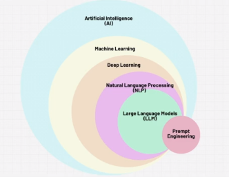
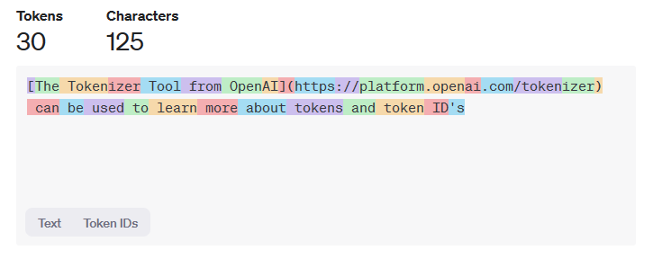
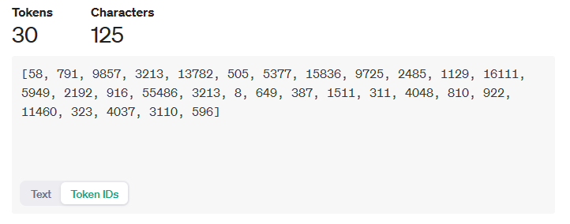

# Intro to LLM's

- AI = boss
- ML is a subset of AI
- Deep Learning is a subset of ML
- NLP (Nat Lang Processing) is a subset of Deep Learning
- LLM is a subset of NLP
- Prompt Engineering is like an interface into this world

There is a difference between a Model and a ChatBot for example: 

- OpenAI is a Company
- they built the GPT-3 model
- ChatGPT is a ChatBot that uses the GPT-x model 

- Anthropic is a company
- they built the Claude model
- There is a Claude ChatBot that uses the Claude model 

# Tokens 

- Tokens are like words, at a super high level 
- OpenAI has an interesting example, **one token = 0.75 words** i.e. a bit less than a typical word

[The Tokenizer Tool from OpenAI](https://platform.openai.com/tokenizer) can be used to learn more about tokens and token ID's

ChatGPT has about 50,000 tokens, each token has a **token ID**

# Word Guessing Machines 

It has been said that an LLM is just a **word guessing machine** and there is a reason for that. 

If you type a prompt into an LLM it's reply is based on the statistics. For example in the OpenAI playground, if you change the mode to completions and type *I want to learn* then click submit, it will complete using statistics, for example the word that follows that opening statement 18% of the time is **more**, it moves on to the next word, again, finding the word that is statistically most likely to follow the word **more** and so on. 

## Rolling a Dice

This can be further emphasised by asking ChatGPT to roll a dice. In Mathematics, a fair unbiased dice as a 16% ish chance of landing on any particular face, therefore the answer in mathematics is that any face has 1/6th of a chance, yet asking ChatGPT, it will base it's answer on the training data used and will typically return the answer **4**. You can ask it why it repeatedly choses 4 but on my tests it refuses to consider this as anything but random, even though repeating the tests with other users on other machines will statistically return the number 4 (in ChatGPT). 

## Picking a Number

Another example of what should be random not being random and instead based on statistical data observed when training is asking ChatGPT **to pick a number between 1 and 30**, it will typically return the number **17**

Again, the chatBot believes the answer to be truly random, yet it will repeatedly bring **17** as the first answer in a new chat responding to that question. 