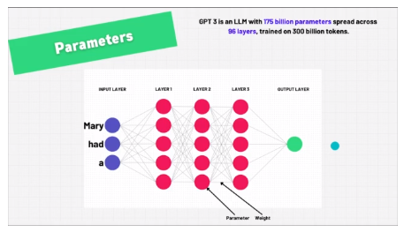
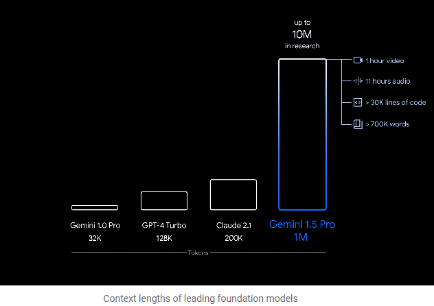

# Intro to LLM's

- AI = boss
- ML is a subset of AI
- Deep Learning is a subset of ML
- NLP (Nat Lang Processing) is a subset of Deep Learning
- LLM is a subset of NLP
- Prompt Engineering is like an interface into this world

There is a difference between a Model and a ChatBot for example: 

- OpenAI is a Company
- they built the GPT-3 model
- ChatGPT is a ChatBot that uses the GPT-x model 

- Anthropic is a company
- they built the Claude model
- There is a Claude ChatBot that uses the Claude model 

# Tokens 

- Tokens are like words, at a super high level 
- OpenAI has an interesting example, **one token = 0.75 words** i.e. a bit less than a typical word

[The Tokenizer Tool from OpenAI](https://platform.openai.com/tokenizer) can be used to learn more about tokens and token ID's

ChatGPT has about 50,000 tokens, each token has a **token ID**

# Word Guessing Machines 

It has been said that an LLM is just a **word guessing machine** and there is a reason for that. 

If you type a prompt into an LLM it's reply is based on the statistics. For example in the OpenAI playground, if you change the mode to completions and type *I want to learn* then click submit, it will complete using statistics, for example the word that follows that opening statement 18% of the time is **more**, it moves on to the next word, again, finding the word that is statistically most likely to follow the word **more** and so on. 

## Rolling a Dice

This can be further emphasised by asking ChatGPT to roll a dice. In Mathematics, a fair unbiased dice as a 16% ish chance of landing on any particular face, therefore the answer in mathematics is that any face has 1/6th of a chance, yet asking ChatGPT, it will base it's answer on the training data used and will typically return the answer **4**. You can ask it why it repeatedly choses 4 but on my tests it refuses to consider this as anything but random, even though repeating the tests with other users on other machines will statistically return the number 4 (in ChatGPT). 

## Picking a Number

Another example of what should be random not being random and instead based on statistical data observed when training is asking ChatGPT **to pick a number between 1 and 30**, it will typically return the number **17**

Again, the chatBot believes the answer to be truly random, yet it will repeatedly bring **17** as the first answer in a new chat responding to that question. 

---

# Inside an LLM

ChatGPT 3 was trained on about 3 billion tokens, which is about 45TB of text data. 

GPT has about 96 layers and 175 billion paremeters

There is a limit to the number of input tokens, for example, as of May 2024, **Gemini 1.5 pro** from Google *will* have an input limit of **1 million tokens**. Currently sitting at 128,000 tokens (context window), some people are getting access to 1 million tokens. The number of input or context tokens defines how much input the LLM can absorb, how many tokens it can pass through its layers. 

## GPT 3

- OpenAI
- 175 billion parameters
- 96 layers
- trained on 300 billion tokens 

## Llama 2

- This is the OpenSource model from Meta
- has 7 billion parameters 
- 32 layers
- trained on 2 trillion tokens

**More tokens trained on AND more parameters = scaling, where more equals better** but there are always trade-offs. 

# The Transformer model 

The Transformer model is a type of neural network architecture that has revolutionized the field of natural language processing (NLP) and has applications in other areas like computer vision. It was introduced in the paper "Attention is All You Need" by Vaswani et al. in 2017.

