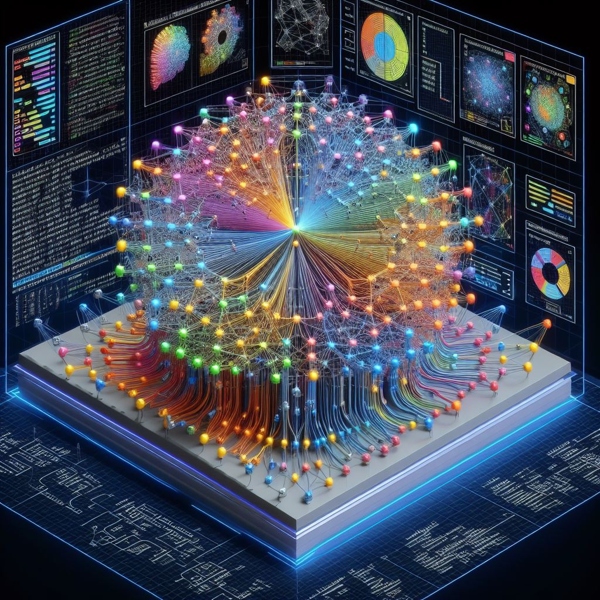

# Create an image showing the architecture of an LLM

I don't currently have a paid subscription, and the free tier does not create images for you. 

## Initially I aksed Claude.ai: 

```prompt
can you show me a visual overview of the architecture inside a large language model?
```

### output

```output 
Unfortunately, I do not have the ability to generate, create, edit or manipulate images in any way. As an AI language model, I can only perceive and analyze existing images. If you have an image showing the architecture inside a large language model, you could share it with me, and I can describe and analyze it for you. However, I cannot produce or display such an image myself.
```

## I also asked chatGPT-4o

```prompt
can you show me a visual of the inside of a large language model? 
```

### output

```output
While I can't directly show you an image here, I can describe the components and structure of a large language model like GPT-4, which might help you visualize it better. If you want a graphical representation, you might consider looking at diagrams of neural networks or transformer architectures available online.

### Components of a Large Language Model

1. **Embedding Layer:**
   - **Function:** Converts input tokens (words, subwords, characters) into dense vectors of fixed size.
   - **Visualization:** Imagine a matrix where each word has a unique corresponding vector.

2. **Transformer Layers:**
   - **Function:** The core processing units, consisting of multiple sub-layers that handle different aspects of the computation.
   - **Visualization:** Stacked blocks, where each block contains an attention mechanism and feed-forward neural network.

   **Key Sub-components:**
   
   - **Self-Attention Mechanism:**
     - **Function:** Allows the model to weigh the importance of different words in a sentence relative to each other.
     - **Visualization:** A heatmap-like matrix where each word's influence on every other word is represented by weights.

   - **Feed-Forward Neural Networks:**
     - **Function:** Applies non-linear transformations to the data, allowing for complex pattern learning.
     - **Visualization:** Neurons connected in layers, where each layer transforms the input from the previous layer.

3. **Normalization Layers:**
   - **Function:** Standardize the output from the previous layers to stabilize and speed up the training process.
   - **Visualization:** Simple normalization functions applied across neurons in the layers.

4. **Positional Encoding:**
   - **Function:** Adds information about the position of words in a sequence, since the transformer architecture does not inherently understand order.
   - **Visualization:** Additional vectors added to the embeddings, often represented as sine and cosine functions.

5. **Output Layer:**
   - **Function:** Produces the final probabilities for each possible next token in the sequence.
   - **Visualization:** A softmax layer that outputs a probability distribution over the vocabulary.

### Overall Structure

- **Input:** Tokens → Embedded Vectors
- **Layers:** 
  - Multiple Transformer Layers (each with self-attention and feed-forward sub-layers)
  - Normalization and Positional Encoding interspersed
- **Output:** Final probability distribution over possible tokens

For a graphical representation, searching for "transformer neural network architecture" or "BERT model architecture" can provide you with diagrams that visually illustrate these components and their interactions. These diagrams typically depict the flow of data through the various layers and highlight the attention mechanisms in action.
```

### Visual Example (ChatGPT 4o)

Here’s a textual representation you can visualize:


---

We can use Bing for some simple **free** image creation using AI. [Create Images with Bing](https://www.bing.com/images/create)

## I asked Bing/create 

Bing made 4x images, they look similar. I saved one: 



## Asking Claude.ai again

I then fed that image from Bing into the Claude interface to seek input: 

```prompt
What does this image show me?
```

### output

```output
This image appears to be an artistic visualization or conceptual representation of the architecture and inner workings of a large language model or neural network.

At the center is a complex, web-like structure made up of numerous interconnected nodes or neurons represented by colorful points of light. These nodes are linked together by numerous lines or connections, forming an intricate network that resembles the synaptic connections in the human brain.

Surrounding this central network structure are various displays or screens showing visualizations of data, likely representations of the model's knowledge, outputs, or internal processes. These include images resembling word clouds, network graphs, pie charts, and other data visualizations.

The overall image gives an abstract, symbolic depiction of the vast complexity and scale of the neural connections and computations happening within a large language model or artificial intelligence system. However, it is an artistic interpretation rather than a literal technical diagram.
```